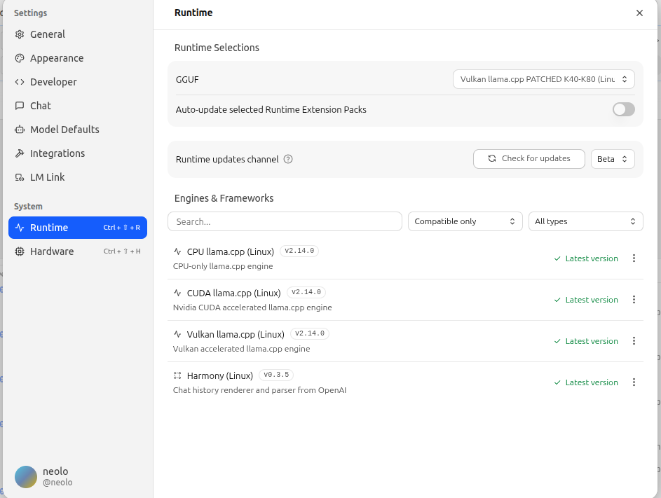
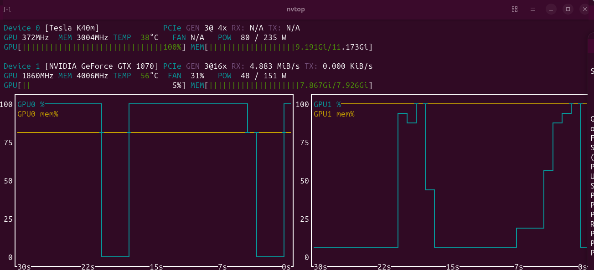

# Patched CUDA / Vulkan Runtime for NVIDIA Tesla K40 / K80 (Kepler) — LM Studio

This repository enables NVIDIA Kepler-architecture datacenter GPUs (Tesla K40, K80, and compatible models) to run LLM inference through **CUDA** or **Vulkan** backends in **LM Studio** and upstream `llama.cpp`.

Kepler is no longer supported by CUDA 12.x, and the stock LM Studio backends are compiled for AVX2-only systems. This project provides build scripts, source patches, CMake fixes, and LM Studio backend manifests to restore compatibility.

**Status:**
- **CUDA backend** — Fully working, highest performance, actively maintained.
- **Vulkan backend** — Working alternative if you prefer not to install CUDA 11.x.





---

## Supported Hardware

| GPU | Architecture | Compute Capability | Status |
|-----|-------------|-------------------|--------|
| Tesla K40 | Kepler | 3.5 | CUDA + Vulkan |
| Tesla K80 | Kepler | 3.7 | CUDA + Vulkan |
| GRID K520 | Kepler | 3.0 | Likely compatible (untested) |
| GTX 780 Ti | Kepler | 3.5 | Likely compatible (untested) |
| GTX 1070 / 1080 | Pascal | 6.1 | CUDA (multi-arch build) |

---

## Quick Start (Pre-built Binaries)

If you want to skip compiling, download the latest release assets and copy the `.so` files into your LM Studio backend folder.

1. Go to [Releases](https://github.com/Delitants/lmstudio-cuda-kepler-patch/releases).
2. Download the appropriate zip for your backend:
   - `lmstudio-cuda-kepler-libraries.zip` — for CUDA backend
   - `lmstudio-vulkan-kepler-libraries.zip` — for Vulkan backend
3. Duplicate your stock LM Studio backend folder (see integration guides below).
4. Copy **only** the `.so` files from the zip into the duplicated folder. **Do not touch any other files.**
5. Use the included `backend-manifest.json` as a reference for editing the manifest in your duplicated folder.
6. Restart LM Studio.

---

## Critical: NVIDIA Driver Version

Kepler GPUs require **driver 470.x or earlier**. Newer drivers (495+) drop Kepler support entirely.

**Recommended driver:** `NVIDIA-Linux-x86_64-470.256.02.run`

### Driver download

Because NVIDIA drivers are proprietary and cannot be redistributed here, download the official installer from NVIDIA:

- **File:** `NVIDIA-Linux-x86_64-470.256.02.run`
- **SHA-256:** `d6451862deb695bb0447f3b7cd6268f73e81168c10e2c10597ff3fa01349b1de`
- **Download:** https://www.nvidia.com/Download/driverResults.aspx/216951/en-us/

### Driver installation (runlevel 3)

```bash
# 1. Disable Nouveau and switch to text mode
sudo systemctl set-default multi-user.target
sudo reboot

# 2. After reboot, stop display manager
sudo systemctl stop gdm3   # or sddm, lightdm

# 3. Run the installer
chmod +x NVIDIA-Linux-x86_64-470.256.02.run
sudo ./NVIDIA-Linux-x86_64-470.256.02.run --no-opengl-files

# 4. Re-enable graphical target
sudo systemctl set-default graphical.target
sudo reboot
```

---

## Disable Wayland on Modern Ubuntu

Wayland and the 470-series proprietary driver do not coexist well. You must switch to **X11**.

### Ubuntu 22.04 / 24.04 / newer

Edit the GDM configuration:

```bash
sudo nano /etc/gdm3/custom.conf
```

Uncomment or add the line:

```ini
[daemon]
WaylandEnable=false
```

Save and reboot:

```bash
sudo reboot
```

Verify you are on X11:

```bash
echo $XDG_SESSION_TYPE
# Expected output: x11
```

If you use **SDDM** (KDE Plasma) or **LightDM**, the equivalent setting is typically in:

- `/etc/sddm.conf` or `/etc/sddm.conf.d/` — set `DisplayServer=x11`
- `/etc/lightdm/lightdm.conf` — no extra change needed, X11 is default

---

## CUDA Backend (Recommended)

The CUDA backend provides the highest performance on NVIDIA GPUs. It requires CUDA Toolkit 11.8 and a source patch to fix batched GEMM on Kepler.

### Full Guide

See **[docs/cuda-kepler-lmstudio.md](docs/cuda-kepler-lmstudio.md)** for:
- Prerequisites (CUDA 11.8, gcc-11, driver 470)
- Building from source with automatic patch application
- Integration into LM Studio
- Troubleshooting

### Quick Build

```bash
# 1. Get the exact source LM Studio expects
git clone https://github.com/ggerganov/llama.cpp.git
cd llama.cpp
git fetch --tags origin
git checkout b8861

# 2. Build from this repo
cd /path/to/this/repo
chmod +x build-scripts/build_cuda_k40_avx1.sh
./build-scripts/build_cuda_k40_avx1.sh /path/to/llama.cpp
```

Output libraries will be in `llama.cpp/build-cuda-k40-avx1/bin/`.

---

## Vulkan Backend (Alternative)

If you cannot install CUDA 11.8, the Vulkan backend is a working alternative. It uses the GPU's Vulkan compute shaders instead of CUDA kernels.

### Build

```bash
cd /path/to/this/repo
chmod +x build-scripts/build_vulkan.sh
./build-scripts/build_vulkan.sh /path/to/llama.cpp
```

Output libraries:
- `libggml-base.so`
- `libggml-cpu.so`
- `libggml-vulkan.so`
- `libllama.so`

### Integration

Same as CUDA: duplicate the stock Vulkan backend folder in LM Studio, replace only the `.so` files, update `backend-manifest.json` to use `["AVX"]`, and restart LM Studio.

---

## Integrate into LM Studio

### 1. Locate LM Studio backends

```bash
ls ~/.lmstudio/extensions/backends/
```

### 2. Back up the stock backend

```bash
cd ~/.lmstudio/extensions/backends/
cp -r llama.cpp-linux-x86_64-nvidia-cuda-avx2-2.14.0 \
     llama.cpp-linux-x86_64-nvidia-cuda-avx2-2.14.0.stock-backup-before-k40k80
```

### 3. Create the K40/K80 backend folder

```bash
cp -r llama.cpp-linux-x86_64-nvidia-cuda-avx2-2.14.0 \
     llama.cpp-linux-x86_64-nvidia-cuda-avx2-k40k80-2.14.0
```

### 4. Replace only the llama.cpp shared libraries

The LM Studio backend folder contains many files. **Only replace the four/five `.so` files below.** Keep everything else untouched.

**Files to REPLACE (from the release zip or your build):**
- `libggml-base.so`
- `libggml-cpu.so`
- `libggml-cuda.so` (CUDA) or `libggml-vulkan.so` (Vulkan)
- `libggml.so`
- `libllama.so`

**Files you must KEEP (LM Studio wrappers — do not touch):**
- `.node` files: `llm_engine_cuda.node`, `liblmstudio_bindings_cuda.node`
- `libllm_engine.so`
- `liblmstudiocore.so`
- `libmtmd.so`
- `libggml_llamacpp.so`
- `display-data.json`

### 5. Update `backend-manifest.json`

Use the provided manifests in `lm-studio-manifest/` as a reference:
- `backend-manifest-cuda.json`
- `backend-manifest.json` (Vulkan)

Key changes from stock:

```json
{
  "cpu": {
    "instruction_set_extensions": ["AVX"]
  },
  "name": "llama.cpp-linux-x86_64-nvidia-cuda-avx2-k40k80"
}
```

The critical change is switching `instruction_set_extensions` from `["AVX2"]` to `["AVX"]`, which allows the backend to load on older CPUs that lack AVX2 (common in K40/K80 server platforms).

### 6. Restart LM Studio

Launch LM Studio, open **Runtime > Loaded Models**, and verify the loaded backend name reflects your custom folder.

---

## Troubleshooting

### `CUBLAS_STATUS_ARCH_MISMATCH` on K40/K80
- The Kepler batched GEMM patch was not applied or the old libraries are cached.
- Rebuild with `./build-scripts/build_cuda_k40_avx1.sh` — it applies the patch automatically.
- Make sure you replaced `libggml-cuda.so` in the LM Studio backend folder.

### `undefined symbol: ggml_cuda_op_mul_mat_vec_f`
- You built from the wrong llama.cpp commit.
- Checkout tag `b8861` and rebuild.

### LM Studio shows "Backend failed to load"
- Verify `cpu.instruction_set_extensions` is `["AVX"]` and not `["AVX2"]` in your manifest.
- Check LM Studio logs for missing `.so` symbols.

### Vulkan build fails with MXFP4 errors
- You skipped the CMake patch. Re-apply `build-scripts/cmake_vulkan_fix.patch` before building.

### Driver 470 installation aborts on modern kernels
- Pass `--disable-nouveau` and `--no-drm` flags if needed.
- For kernels newer than 6.5, you may need the [nvidia-470 dkms patch](https://github.com/NVIDIA/open-gpu-kernel-modules/issues/others) or use the distro-packaged `nvidia-driver-470` if available.

### CUDA build fails with gcc errors
- CUDA 11.8 requires gcc ≤ 11. Install `gcc-11` / `g++-11`.
- Pass explicitly: `CC=/usr/bin/gcc-11 CXX=/usr/bin/g++-11 ./build-scripts/build_cuda_k40_avx1.sh ...`

---

## License

- Build scripts and patches: MIT
- `llama.cpp`: MIT (upstream)
- LM Studio wrapper binaries and `.node` files: property of Element Labs / LM Studio; not redistributed here
- NVIDIA driver and CUDA: proprietary NVIDIA licenses; not redistributed here
